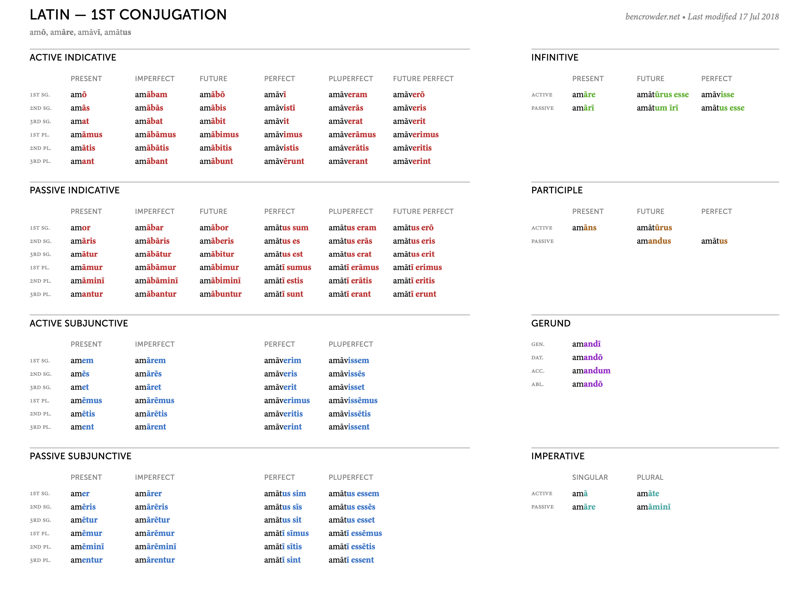
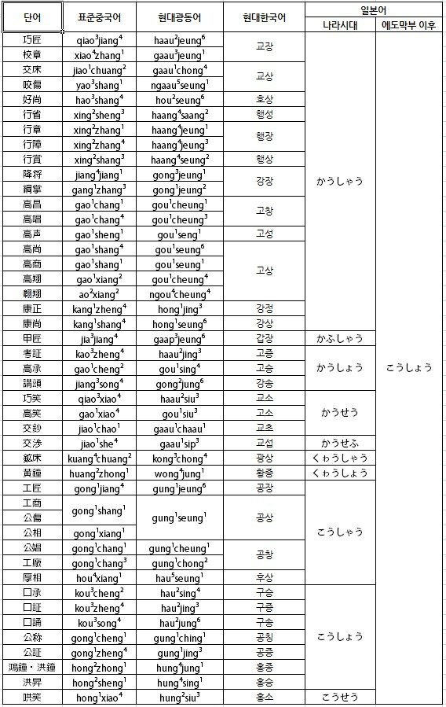

### 明窓浄机・めいそうじょうき・mēsōjōki
###### noun, yojijukugo. well-lit and clean desk conducive to learning
Everything you need to learn Japanese from first word to first novel.

# Contents
- [Community](#community)
- [Curriculum](#curriculum)
- [Reach Me](#reach-me)

# Community
Link to discord goes here.

# Curriculum
- [Philosophy](#philosophy)
  - [Irreducible Components](#irreducible-components)
  - [Extensive Consumption](#extensive-consumption)
  - [Socialize](#socialize)
  - [Summary](#summary)
- [Prework](#prework)
- [Squiggles](#squiggles)
- [Foundations](#foundations)
- [中級・ちゅうきゅう](#intermediate)
- [上級](#上級)
- [真如](#真如)

---

# Philosophy

## Course Roadmap and Philosophy
The quickest, most effective way to learn any language is based on these three principles. We'll see how they apply to learning Japanese specifically.

## Language Learning Linchpins
1. **Start learning the irreducibles as soon as possible.** For Japanese, that means vocabulary and kanji.
2. **Consume a lot of native material.** Read books and articles and manga; watch movies and anime; listen to podcasts and music.
3. **Make it social.**

Let's get into what each of these means.

## Irreducible Components

First, all languages have a number of what I'm going to call **irreducible components**, things you have to learn that you can't gimmick yourself out of. There are no shortcuts for learning these things (which doesn't necessarily mean they have to always be dull, hard work). Irreducible components exist in contrast to something that you could learn at the more conceptual level, the type of content we usually think of as being on a math or a chemistry test, for example. These kinds of tests are full of problems that target your ability to apply concepts rather than check your recall on rote memorization. (Hopefully.) You learn how to multiply numbers, and then you apply that knowledge in novel ways on the test, i.e., you multiply two numbers that you've never multiplied before. Compare that with learning vocabulary. There is no concept under the word φυχή that tells you what that word means. That word, *psyche*, means "life" in ancient Greek. The word itself is the most fundamental piece of knowledge you need to understand it. There is no word multiplication you can do to figure out what that word means. You know it or you don't. (With some big caveats.)

Let's talk briefly about those caveats because it's not all sheer, rote memorization. The more you learn a language, the more tricks you accumulate to help you out, at least to some degree. If you know that adding "-(e)r" to the end of a verb in English is one pattern for coming up with nouns for people who do those things professionally or seriously or frequently, then you can start to guess what a "baker" is if you know the word "bake". You can start to guess what a "writer" is if you know the word "write". I'm told that in the original Hebrew, God's confrontation with Cain is [quite sassy](https://mobile.twitter.com/JessiSheron/status/1503904577380405255). It involves the expression "my brother's keeper", which then turned into a whole book and movie inspired by the same line, and it means... you get it.

You've probably also accumulated some cultural knowledge that helps out too. Many people, seeing the word romanized as *psyche*, probably started to have some ideas about the general direction that word was going to take since we have "psyche" and "psychology" and "psychic" in everyday use in English.

Still, these caveats are of relatively tiny help in the vast wilderness of learning vocabulary, which is itself only one example of an irreducible component of languages. For the most part, you have to learn hundreds or thousands of these things to start feeling comfortable in your new language, so it pays to start early.

Vocabulary is arguably the most fundamental of these irreducible components, no matter the language you're learning. Sure, if you're learning a language that's relatively similar to one you already know—say, for example, an English speaker learning French or Spanish—the "height", so to speak, of this irreducible component will be lower than it would be for learning a very different language—c.f., that same English speaker learning Mandarin—but importantly, vocabulary, relatively familiar or relatively unfamiliar, is an irreducible component. No matter what, you will still have to spend many *many* hours learning vocabulary.

For most (all?) languages, verbal conjugation is another irreducible. It will take many *many* hours of practice to be able to quickly identify and produce conjugations. Indeed, for many languages, the conjugation (or case) system is one of the biggest hurdles to entry. For example, Latin has a bad reputation for its conjugation system. I'm a huge fan of the Dowling method for learning Latin and Latin-descended languages. These languages have rather more complex and irregular systems of conjugation (see image below), and the Dowling method has you start learning the entirety of the verbal conjugation system almost from day one.

This is the conjugation for 1 major type of verb in Latin. There are 4 major types, each with a layout as complex as the above, and worse still there are plenty of verbs with irregular conjugations that deviate a little (or a lot) from one of the four standard conjugations. For Japanese, verb (and noun and adjective) conjugation is definitely an irreducible component, and not a trivial one either, but I'm not recommending you start learning all Japanese conjugations from the beginning of your studies. There are more pressing concerns.

Such as kanji. Kanji is the much more pressing concern. For the most part, written Japanese uses kanji for everything with a little bit of hiragana thrown in for conjugation and other grammatical purposes. You need to learn about 1,000 kanji to be able to start telling your head from your ass in a text, and you need about 2,000 kanji to start getting the nuances.

If that weren't reason enough to learn kanji (there's still a camp of people who think they don't need to learn kanji?), even listening comprehension is made much, much easier by knowing kanji. I remember my first semester of study abroad in Tokyo, my Japanese language professor said (translating), "Japanese is full of homonyms. How do Japanese people tell the difference between *kanji* (感じ) and *kanji* (漢字)? Context, and something that's happening in their heads: *kanji*." There's a reason that Japanese has kept using kanji while Korean, another language with a zillion Chinese-origin words, was able to more or less easily drop them. Take a look at this chart ([source](https://www.quora.com/When-Koreans-can-abandon-Chinese-characters-why-cant-the-Japanese)).

The 1st column on the left shows the original Chinese word with characters, and the 2nd and 3rd columns show its modern pronunciation in Mandarin and Cantonese, respectively. The 4th column shows the modern Korean pronunciation. Korean used to use kanji (called hanja), but now it mostly uses an alphabet (hangeul). The second to last column is the ancient Japanese pronunciation and the last column is the modern Japanese pronunciation.

What are we noticing?

That 45 words, mostly having all different pronunciations in modern Mandarin, Cantonese, and Korean each, have a single pronunciation in modern Japanese, *koushou*. Some of these words are archaic, but plenty of them are not. This isn't even all the words that are pronounced *koushou* in modern Japanese. So when you hear the word *koushou*, how do you figure out which of these words it is? Context and kanji. Sure, maybe you just memorize 45+ different possible meanings for the sound *koushou*, but having kanji in your head helps a ton.

Plus, remember those caveats from earlier? Those little helper patterns that make learning new words easier? Kanji is one of those caveats for Japanese. When you learn kanji, you (kind of) start to get free words. Each kanji has one or at most a few core meanings, and two or at most a few core readings. When you combine one kanji with another, you start to get new, somewhat predictable meanings. 無, *mu*, means "no, none, nothing" and 口, *kuchi*, means mouth. Not surprisingly, 無口, *mukuchi*, means "taciturn, reticient, quiet".

I hope you're sufficiently motivated. If you're used to life inside of an alphabet, kanji can seem tedious and archaic, but I pinky promise, in the long run they help with both listening and reading comprehension. Plus, they're just beautiful, aren't they?

## How to apply it

1. **Learn hiragana**. All of them. Virtual Anki cards or physical flash cards or writing the full chart from memory. Take a week or two or even a month or five to learn them.
2. **Learn katakana**. All of them. Timeframe and methodology as above.
3. **Start learning kanji**. As soon as you know hiragana and katakana. Continue until (and probably after) you die. You exist to learn kanji. This is your life now. When you know them all, no you don't. Welcome to the enclave. You can use
    - physical flash cards, or
    - virtual flashcards like [Anki](https://apps.ankiweb.net/), or
    - [WaniKani](https://www.wanikani.com/), my personal favorite (I'm not being paid to say that), or one of its (free) derivatives, or
    - even something like [Remembering the Kanji](https://www.goodreads.com/book/show/11377627-remembering-the-kanji-1) to get yourself started remembering meanings but not pronunciations

Irreducible components, namely vocab and kanji, can be massive barriers to comfortably understanding and producing material in the target language, so start early, because the benefits compound continuously (I have no data to back that, merely a sincere and powerful feeling behind my sternum).

So start, as close to day one as possible. Be flexible, but be relentless. Just a few, or 10, or 20 new vocabulary words a day. Start with a few hundred of the most common words. When you find a song, anime, manga, book you like, pick out vocab, even a single new word, and throw it on your pile of flashcards.

## Extensive Consumption

Next, you need to **consume lots of native material**. Lots. As soon as you can. Even if a lot of it doesn't make sense. Importantly, this has much higher priority than language production (though still a necessary component). The credit for this idea goes entirely to Kato Lomb, who has written one of the best books ever on language learning (and indeed one of the best books ever, period), [*Polyglot: How I Learn Languages*](https://www.goodreads.com/en/book/show/6290281). For credit, merely I can vouch for its effectiveness.

Famously, Lomb learned a ton of new languages to a high proficiency during her lifetime, truly a pioneer for polyglots, and she would start her journey on a new language at its dictionary. If she were learning Japanese, she would start by combing through a Japanese dictionary. Not a Japanese-Hungarian dictionary (Hungarian was her native language), just a native Japanese dictionary. She wasn't especially trying to understand (and definitely not trying to memorize). Instead, she was analyzing it like a crossword puzzle.

After she'd finished with the dictionary, and still early in her studies of her new language, much earlier than we're generally accustomed to, she'd start reading. Again, she wouldn't especially be reading for understanding, a least not all of the material, and in the beginning not even most of it. Just moving through the book, looking for what she did recognize, passing by everything else like a tourist in a national park: admiringly. No new vocab lists, no notes.

She'd keep learning her new language, and she'd reread that same book after her first pass of it. This time she'd be looking for what she missed previously. Again, not all of it, just more of it than what she'd gotten on the previous read. If something was especially recognizable—a grammar pattern she'd just learned, a new piece of vocabulary–she might make a note in the margins of the book. If she saw a word or grammatical pattern appearing frequently that she didn't know, she might start to look some of them up.

She'd continue in this way, reading and rereading, making new notes of what she recognized, occasionally looking up what appeared frequently that she didn't know—the low hanging fruit—and passing everything else by. It was unimportant. She would understand it eventually, whether through her formal studies or, miraculously, from context clues as her prowess in her new language increased.

This is well attested to have worked for her. Using this method, she achieved fluency in some 17 languages, many of which she learned after the age of 40. Her principle was simple: you must consume a tone of the language you want to learn. Production can come later.

To give you a general idea, though everyone is different, consumption to production should be anywhere from 2:1 to as big of a difference as 10:1. Yes, that much focus should be put on consumption. Native material consumption.

I remember the first time I went to Japan was between my freshman and sophomore years of college for a summer intensive program. At the time, I had a year of language study at the university level under my belt, so while I had a pretty strong foundation, I still felt I had a long way to go to being comfortable in real-life conversation with native speakers. The summer intensive program was going to be great, a chance to speak Japanese all summer, hopefully with plenty of native speakers.

We—my cohort and I—were all excited to practice a lot of Japanese, but two classmates were especially so. They'd determined to speak Japanese almost exclusively even (and especially) when talking to each other.

While I admire their enthusiasm, I don't think that was ultimately a great technique for improving their Japanese, at least not their technical ability with it. Don't get me wrong, I admired their enthusiasm, and there's nothing wrong with the excitement of hearing Japanese come out of your own mouth—heck, that's a lot of the joy of language learning!—they were ultimately deploying their still-developing knowledge of Japanese in a feedback loop that was not to their benefit.

In the field of second language acquisition, you might say that they were reinforcing each other's [interlanguage](https://en.wikipedia.org/wiki/Interlanguage) instead of being pulled closer to natural Japanese by a native or fluent speaker.

You can imagine two native English speakers hanging out in Japanese without a native speaker there to intervene. It created a kind of echo chamber for them, inside of which they spoke a lot of and heard a lot of Japanese-from-an-English-speaker's-perspective.  They could have been getting constant feedback from an outside (native or fluent) source, pushing them to grow their Japanese ability, even if only from hearing this other person's native Japanese in action; instead, they were reinforcing each other's Japanese habits, some good, sure, but some... less than natural.

For Japanese, for most learners, there's a longer runway to this than there is to other languages. For example, an English speaker can start chewing on a text in Spanish (in the Lombian sense) almost from day one. Missing a lot of information, yes, but they can start to decipher at least some information from the text, and that ramps up relatively quickly. (Really big disclaimer: I am not claiming Spanish is easy to learn. All language learning comes with unique challenges.) Japanese, in comparison, remains harder to decipher for longer, meaning there's more of a delay to learning from native material. In the beginning, the experience is very much summarized as: "Look at all these kanji! I don't know any of these kanji! I recognize that single hiragana, and nothing else!"

And that's totally okay! I say all of this not to discourage, but to temper expectation. Put consuming native Japanese content in your view finder with the gentle reminder that it's a long road.

## How to apply it

- **Compile a list of some favorite movies, books, manga, songs.** Prepare to read and reread, watch and rewatch, listen and relisten. See below for some ideas
  - **Why did you decide to learn Japanese?** Was there a movie, a show, a book that inspired you?
  - **Childhood favorites.** The Harry Potter books are published in nearly every language on the planet, and you can get them online for free or from an ebook publisher or even download them from J.K. Rowling's webpage for a fee. *Eragon* was a childhood favorite for me. I reread it multiple times while learning Japanese, and I'm rereading it now as I learn Spanish.
  - **Explore some light novels.** These are a perfect entry-level difficulty to aim for. For books that are truly children's literature, they're actually harder to learn from as a foreign language learner. They're almost entirely in hiragana in something akin to baby-talk. Light novels, however, are written with kanji, many of them providing the readings for those kanji, at a level easily consumed by Japanese middle or high schoolers. This is prime difficulty level for you, the foreign language learner. They're interesting and grammatically similar to what you'd see in a Japanese textbook.
  - **Podcasts.** There are actually a ton of excellent podcasts aimed at Japanese language learners. JapanesePod101, NihongoSwitch, ... the list goes on.
  - **Manga and anime.** Ditto.
  - **Whatever you're interested in**. Can you consume it in Japanese?
- **Reminder: it's okay if a lot or even most of it doesn't make sense.** Be like Kato Lomb. You're playing the long game. You don't have to understand. Just enjoy the scenery, and your understanding will grow with them. 

## Socialize

## How to apply it

## Summary

# Prework

## Motivation

## Suggested Reading: *English Grammar for Students of Latin*

## Logistics
### Time Commitment
### Software and Tools

# Squiggles

## Hiragana
## Kanji
## Katakana

[Back to Curriculum](#curriculum)

# Foundations

Lean into starting on the irreducibles. Master hiragana and katakana and **figure out how you like to learn kanji**.

## Optional Benchmark: JLPT N4

| Textbooks | Reading     | Listening     |
|:---       |:---         |:---           |
|Genki I    |Manga        |Music          |
|Genki II   |Music Lyrics |JapanesePod101 |
|Tofugu     |             |               |

[Back to Curriculum](#curriculum)

## 中級・ちゅうきゅう 

Lean into extensive reading (or watching or listening).

## Optional Benchmark: JLPT N3

| Textbooks | Reading           | Listening       |
|:---       |:---               |:---             |
|Tobira     |Childhood Favorite|Nihongo Switch  |
|Book on culture (uchi, soto, amaeru, etc.)|||

[Back to Curriculum](#curriculum)

# 上級

Lean *way* into extensive reading (or watching or listening).

## Optional Benchmark: JLPT N2

| Textbooks                | Reading               | Listening             |
|:---                      |:---                   |:---                   |
|*新完全マスタ：文法（N2）*    |Popular (adult) fiction|Podcasts               |
|*Making Sense of Japanese*|Twitter                |Nihongo No Mori JLPT N2|

[Back to Curriculum](#curriculum)

# 真如

## Optional Benchmark: JLPT N1

| Textbooks        | Reading                       | Listening          |
|:---              |:---                           |:---                |
|Shinkanzen bunpō  |classics of modern Japanese lit|Podcasts, TV, Movies|
|Classical Japanese||||

[Back to Curriculum](#curriculum)

# Reach Me
