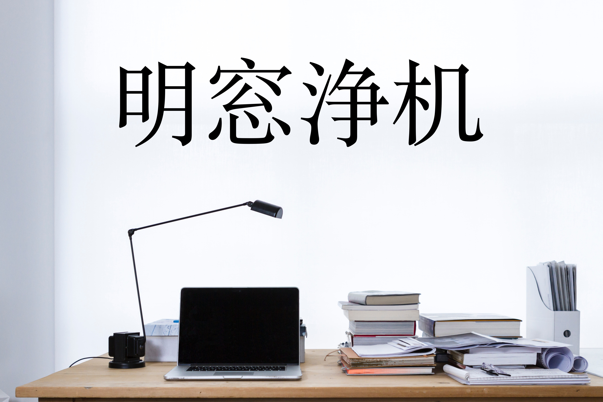

### 明窓浄机・めいそうじょうき・mēsōjōki
###### noun, yojijukugo; well-lit and clean desk conducive to learning
Everything you need to learn Japanese from first word to first novel.

# Contents
- [Summary](#summary)
- [Community](#community)
- [Curriculum](#curriculum)
- [Reach Me](#reach-me)

# Summary
Summary goes here.

# Community
Link to discord goes here.

# Curriculum
- [Prework](#prework)
- [Squiggles](#squiggles)
- [Foundations](#foundations)
- [中級・ちゅうきゅう](#intermediate)
- [上級](#上級)
- [真如](#真如)

---

## Prework

#### Course Roadmap and Philosophy
#### Time Commitment
#### Motivation
#### Software and Tools
#### Suggested Reading: *English Grammar for Students of Latin*

## Squiggles

#### Hiragana
#### Kanji
#### Katakana

[Back to Curriculum](#curriculum)

## Foundations

#### Optional Benchmark: JLPT N4

| Textbooks | Reading    | Listening      |
|:----------|:-----------|:---------------|
|Genki I    |Manga       |Music           |
|Genki II   |Music Lyrics|JapanesePod101  |
|Tofugu     |            |                |

[Back to Curriculum](#curriculum)

## 中級・ちゅうきゅう 

#### Optional Benchmark: JLPT N3

| Textbooks | Reading          | Listening      |
|:----------|:-----------------|:---------------|
|Tobira     |Childhood Favorite|Nihongo Switch  |
|Book on culture (uchi, soto, amaeru, etc.)|||

[Back to Curriculum](#curriculum)

## 上級

#### Optional Benchmark: JLPT N2

| Textbooks                | Reading               | Listening             |
|:---                      |:---                   |:---                   |
|*新完全マスタ：文法（N2）*    |Popular (adult) fiction|Podcasts               |
|*Making Sense of Japanese*|Twitter                |Nihongo No Mori JLPT N2|

[Back to Curriculum](#curriculum)

## 真如

#### Optional Benchmark: JLPT N1

| Textbooks        | Reading                       | Listening          |
|:---              |:---                           |:---                |
|Shinkanzen bunpō  |classics of modern japanese lit|Podcasts, TV, Movies|
|Classical Japanese||||

[Back to Curriculum](#curriculum)

# Reach Me
